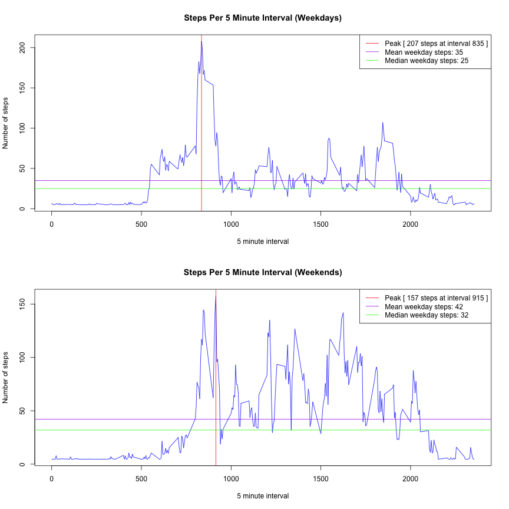

Reproducible Research: Peer Assignment 1
============================================================

Chris Thatcher

# Introduction

> It is now possible to collect a large amount of data about personal movement using activity monitoring devices such as a Fitbit, Nike Fuelband, or Jawbone Up. These type of devices are part of the “quantified self” movement – a group of enthusiasts who take measurements about themselves regularly to improve their health, to find patterns in their behavior, or because they are tech geeks. But these data remain under-utilized both because the raw data are hard to obtain and there is a lack of statistical methods and software for processing and interpreting the data._

> _This assignment makes use of data from a personal activity monitoring device. This device collects data at 5 minute intervals through out the day. The data consists of two months of data from an anonymous individual collected during the months of October and November, 2012 and include the number of steps taken in 5 minute intervals each day._

> (Intro from <https://github.com/rdpeng/RepData_PeerAssessment1>)

## Requirements

We are going to keep this analysis to the core R packages for the simplest
reproducibility.

## Loading and preprocessing the data

### Extract, Transform, Load

**Note:** _We will be using the acronym **ETL** throughout this document.  ETL is an 
industry acronym for Extract, Transform, Load.  If you'ld like to know where
this term came from, check out <http://en.wikipedia.org/wiki/Extract,_transform,_load>._

Here are the constants we'll us to describe the data we need to get, preprocess 
and analyze:


```r
# CONSTANTS 
# Where we will be looking for data, on the net and locally.
RAW_DATA_URL = "https://d396qusza40orc.cloudfront.net/repdata%2Fdata%2Factivity.zip"
RAW_DATA_FILE = "data/activity.csv"
RAW_DATA_IMPUTED_STEPS = "data/activity-imputed-steps-by-mean.csv"
RAW_DATA_IS_WEEKEND = "data/activity-is-weekend.csv"
```

#### Extract: Getting the Data

To get started we need the data.  The following code defines a function **etl.extract**
which will check for the expected file in the data directory.  If it's not there, it
will download it, trying to account for your OS.  

**Note:** Some data from this step of **data extract** is ignored by
git, via the .gitignore file, so the first time you clone this repo, the data 
won't be there. In particular its the **RAW_DATA_FILE**.


```r
# ETL Extract Phase - Gets the data.
(etl.extract = function(refresh=FALSE){
    
    # Make sure we have the data to work with locally, otherwise go get it.
    if( refresh || !file.exists(RAW_DATA_FILE) ){

        message("Extracting data from url.")

        data_zip = sprintf("%s.zip", RAW_DATA_FILE)

        if("Windows" == Sys.info()["sysname"])
            download.file(RAW_DATA_URL, destfile=data_zip)
        else
            download.file(RAW_DATA_URL, destfile=data_zip, method="curl")

        # clean up after ourselves
        unzip(data_zip, exdir='data')
        file.remove(data_zip)
    } else {
        message("Extracted data found locally, not repeating.")
    }
    
})()
```

```
## Extracting data from url.
```

```
## [1] TRUE
```

Before we move on to the next phase of our ETL, lets get a sense of what we are 
starting with.  We have three field columns, **steps**, **date**, and 
**interval**. Steps and interval look like they are probably integers, while 
date is a calendar day. There are a number of rows with NA's which we are 
going to have to figure out what to do with.


```r
raw_data = read.csv(RAW_DATA_FILE)

head(raw_data) #First few rows.
```

```
##   steps       date interval
## 1    NA 2012-10-01        0
## 2    NA 2012-10-01        5
## 3    NA 2012-10-01       10
## 4    NA 2012-10-01       15
## 5    NA 2012-10-01       20
## 6    NA 2012-10-01       25
```

```r
summary(raw_data) #Summary
```

```
##      steps                date          interval     
##  Min.   :  0.00   2012-10-01:  288   Min.   :   0.0  
##  1st Qu.:  0.00   2012-10-02:  288   1st Qu.: 588.8  
##  Median :  0.00   2012-10-03:  288   Median :1177.5  
##  Mean   : 37.38   2012-10-04:  288   Mean   :1177.5  
##  3rd Qu.: 12.00   2012-10-05:  288   3rd Qu.:1766.2  
##  Max.   :806.00   2012-10-06:  288   Max.   :2355.0  
##  NA's   :2304     (Other)   :15840
```

```r
number_of_na_rows = sum(is.na(raw_data$steps))

rm(raw_data) #Clean up the execution environment.
```

_Note that the raw data a column **steps** with 2304 NA's._
We'll want to remove and/or impute these for our analysis.  

#### Transform: Cleaning the Data

Our analysis requires 2 additional data sets, the first replaces (imputes) the NA values 
with the row mean and the second adds a column indicating whether the day is
a weekend day or weekday. We serialize the resulting set to a new data files so
we an selectively load them later.  We will not let the transformed data set be
committed to the code repository so the analysis can be fully reproduced.


```r
(etl.transform = function(refresh=FALSE){
    
    # loads the raw source data set, removes rows with NA, seperately imputes
    # NA rows with a mean value, then serializes the new data to disk for faster
    # processing in etl.load
    if(refresh || !(file.exists(RAW_DATA_IMPUTED_STEPS) && file.exists(RAW_DATA_IS_WEEKEND))){
        
        etl.extract(refresh=refresh)
        
        # This data set is pretty small so no need for optimized loaders from
        # R packages like data.table, eg fread.  The data is pretty clean other
        # than the NA's in the 'step' column so we dont need to do a lot of data
        # transform for this project.
        raw_data = read.csv(RAW_DATA_FILE)
        
        # We are going to try to use tidy data principles to save some extra 
        # columns for analysis later. 
        
        # The imputed steps just replace the NA entries with the mean value
        # of the steps over the valid rows.
        message(sprintf("Saving steps imputed by mean to %s", RAW_DATA_IMPUTED_STEPS))
        mean_steps = floor(mean(raw_data$steps, na.rm=TRUE))
        imputed_steps = data.frame(steps=raw_data$steps)
        imputed_steps$steps[is.na(imputed_steps$steps)] = mean_steps
        write.csv(imputed_steps, file=RAW_DATA_IMPUTED_STEPS, row.names=FALSE)
        
        # We are also going to need to do a comparision of weekdays vs weekends
        # so we are going to compute and save another column to serve this purpose.
        message(sprintf("Saving 'is_weekend' to %s", RAW_DATA_IS_WEEKEND))
        day_of_week = weekdays(as.Date(raw_data$date))
        is_weekend = data.frame(is_weekend=( day_of_week == "Saturday" | day_of_week == "Sunday" ))
        write.csv(is_weekend, file=RAW_DATA_IS_WEEKEND, row.names=FALSE)
        
    } else {
        message("Raw data already transformed, not repeating.")
    }
    
})()
```

```
## Extracted data found locally, not repeating.
## Saving steps imputed by mean to data/activity-imputed-steps-by-mean.csv
## Saving 'is_weekend' to data/activity-is-weekend.csv
```

#### Load: Ready for Analysis

The final phase of ETL, is a special serialization called **load** which for
our purposes simply loads the data sets into memory so we can query it with R.
This particular data set is relatively small and we could easily get away with
not serializing our data sets for future analysis.

Here all we do is check for a successful transform, load the serialized data.  


```r
# etl.load will load the raw_data bu default, omitting rows with NA's.  We
# can additionally choose to load the data frame of imputed steps to avoid
# NA's entirely, and also add the 'is_weekend' column.
etl.data = (etl.load = function(refresh=FALSE, omit_na=TRUE, imputed_steps=FALSE, is_weekend=FALSE){
    
    # Make sure we've extracted and transform the data before we try to load it
    etl.transform(refresh=refresh)
    
    # loads the data we need for our plot exploration, in general we make sure to
    # cast the date column to a Date
    message(sprintf("Loading base data %s", RAW_DATA_FILE))
    loaded_data = read.csv(RAW_DATA_FILE, colClasses=c(date="Date"))
    
    
    if(imputed_steps){
        message(sprintf("Loading imputed_steps data %s", RAW_DATA_IMPUTED_STEPS))
        loaded_data$steps = read.csv(RAW_DATA_IMPUTED_STEPS)$steps
    }
    
    if(is_weekend){
        message(sprintf("Loading is_weekend data %s", RAW_DATA_IS_WEEKEND))
        loaded_data$is_weekend = read.csv(RAW_DATA_IS_WEEKEND)$is_weekend
    }
    
    if(omit_na){
        message(sprintf("Omitting rows with NA values."))
        loaded_data = na.omit(loaded_data)
    }
    
    return(loaded_data)
    
})()
```

```
## Raw data already transformed, not repeating.
## Loading base data data/activity.csv
## Omitting rows with NA values.
```

To start we've loaded the set with NA's removed. Here is a summary of NA omitted 
data, ready for analysis:


```r
mean_steps = mean(etl.data$steps)
summary(etl.data)
```

```
##      steps             date               interval     
##  Min.   :  0.00   Min.   :2012-10-02   Min.   :   0.0  
##  1st Qu.:  0.00   1st Qu.:2012-10-16   1st Qu.: 588.8  
##  Median :  0.00   Median :2012-10-29   Median :1177.5  
##  Mean   : 37.38   Mean   :2012-10-30   Mean   :1177.5  
##  3rd Qu.: 12.00   3rd Qu.:2012-11-16   3rd Qu.:1766.2  
##  Max.   :806.00   Max.   :2012-11-29   Max.   :2355.0
```

Also we have the option to leverage the data set with all the NA's imputed with
the mean value of steps per interval which we will need to use later.


```r
summary(etl.load(imputed_steps=TRUE))
```

```
##      steps             date               interval     
##  Min.   :  0.00   Min.   :2012-10-01   Min.   :   0.0  
##  1st Qu.:  0.00   1st Qu.:2012-10-16   1st Qu.: 588.8  
##  Median :  0.00   Median :2012-10-31   Median :1177.5  
##  Mean   : 37.33   Mean   :2012-10-31   Mean   :1177.5  
##  3rd Qu.: 37.00   3rd Qu.:2012-11-15   3rd Qu.:1766.2  
##  Max.   :806.00   Max.   :2012-11-30   Max.   :2355.0
```

## Data Exploration

Now that we have the data preprocessed, we are ready to start the analysis phase.
We have several questions:

* What is mean total number of steps taken per day?
* What is the average daily activity pattern?
* Are there differences in activity patterns between weekdays and weekends?


### Mean Total Number of Steps Taken Per Day

To begin, lets aggregate the steps by calendar day.


```r
steps_per_day = aggregate(steps ~ date, etl.data, FUN=sum)

head(steps_per_day)
```

```
##         date steps
## 1 2012-10-02   126
## 2 2012-10-03 11352
## 3 2012-10-04 12116
## 4 2012-10-05 13294
## 5 2012-10-06 15420
## 6 2012-10-07 11015
```

Here's a simple frequency histogram of steps per day.


```r
mean_steps_na_omitted = floor(mean(steps_per_day$steps))
median_steps_na_omitted = median(steps_per_day$steps)

with(steps_per_day, {
    main_label = sprintf("Steps Per Day (%s to %s)", date[1], date[nrow(steps_per_day)])
    mean_steps = mean_steps_na_omitted
    median_steps = median_steps_na_omitted
    hist(
        steps, 
        main=main_label, 
        col="grey",
        xlab="Steps Per Day"
    )
    abline(v=mean_steps,col="red")
    abline(v=median_steps, col="blue")
    legend(
        "topright",
        legend=c(
            sprintf("Mean steps (%s)", mean_steps),
            sprintf("Median steps (%s)", median_steps)
        ),
        col=c("red", "blue"),
        lty=c(1, 1)
    )
})
```

 

Here is a summary including the mean and median of the step taken per day:


```r
summary(steps_per_day)
```

```
##       date                steps      
##  Min.   :2012-10-02   Min.   :   41  
##  1st Qu.:2012-10-16   1st Qu.: 8841  
##  Median :2012-10-29   Median :10765  
##  Mean   :2012-10-30   Mean   :10766  
##  3rd Qu.:2012-11-16   3rd Qu.:13294  
##  Max.   :2012-11-29   Max.   :21194
```

### Average Daily Activity Pattern

Lets take a look at the average number of steps over 5 minutes intervals across 
the data set.  This will give us a picture of when during the day the subject is
most often active.


```r
daily_interval = aggregate(steps ~ interval, etl.data, FUN=mean)

with(daily_interval, {
    max_interval_row = which.max(daily_interval[,2])
    max_steps_mean = floor(steps[max_interval_row])
    max_interval = interval[max_interval_row]
    steps_mean = floor(mean(steps))
    steps_median = floor(median(steps))
    plot(
        interval,
        steps,
        main="Steps Per 5 Minute Interval",
        col="blue",
        ylab="Number of steps",
        xlab="5 minute interval",
        type="l"
    )
    abline(v=max_interval, col="red")
    abline(h=steps_mean, col="purple")
    abline(h=steps_median, col="green")
    legend(
        "topright",
        legend=c(
            sprintf("Peak [ %s steps at interval %s ]", max_steps_mean, max_interval),
            sprintf("Mean weekday steps: %s", steps_mean),
            sprintf("Median weekday steps: %s", steps_median)
        ),
        col=c("red","purple","green"),
        lty=c(1,1,1)
    )
})
```

 

### Imputing missing values

So far our analysis has been making use of only rows with no NA values in the
**steps** column.  Recall there were 2304 rows we excluded. 
Let's reload the data using our impute strategy (which replaces the NA's with 
the computed mean of 37.3825996 steps). We might as well add the 
**is_weekend** column now too.


```r
etl.data = etl.load(imputed_steps=TRUE, is_weekend=TRUE)
```

```
## Raw data already transformed, not repeating.
## Loading base data data/activity.csv
## Loading imputed_steps data data/activity-imputed-steps-by-mean.csv
## Loading is_weekend data data/activity-is-weekend.csv
## Omitting rows with NA values.
```

```r
summary(etl.data)
```

```
##      steps             date               interval      is_weekend     
##  Min.   :  0.00   Min.   :2012-10-01   Min.   :   0.0   Mode :logical  
##  1st Qu.:  0.00   1st Qu.:2012-10-16   1st Qu.: 588.8   FALSE:12960    
##  Median :  0.00   Median :2012-10-31   Median :1177.5   TRUE :4608     
##  Mean   : 37.33   Mean   :2012-10-31   Mean   :1177.5   NA's :0        
##  3rd Qu.: 37.00   3rd Qu.:2012-11-15   3rd Qu.:1766.2                  
##  Max.   :806.00   Max.   :2012-11-30   Max.   :2355.0
```

Now that our data has been updated with missing values replaced with the mean 
number of steps per interval, let's see look at our earlier histogram and mean
and median values.


```r
steps_per_day = aggregate(steps ~ date, etl.data, FUN=sum)

mean_steps_imputed = floor(mean(steps_per_day$steps))
median_steps_imputed = median(steps_per_day$steps)

with(steps_per_day, {
    main_label = sprintf(
        "Steps Per Day With Imputed Values (%s to %s)", 
        date[1], 
        date[nrow(steps_per_day)]
    )
    mean_steps = mean_steps_imputed
    median_steps = median_steps_imputed
    hist(
        steps, 
        main=main_label, 
        col="grey",
        xlab="Steps Per Day"
    )
    abline(v=mean_steps,col="red")
    abline(v=median_steps, col="blue")
    legend(
        "topright",
        legend=c(
            sprintf("Mean steps (%s)", mean_steps),
            sprintf("Median steps (%s)", median_steps)
        ),
        col=c("red", "blue"),
        lty=c(1, 1)
    )
})
```

 

Notice that the mean has changed changed by -15
and the median has changed by -109.
The imputation has some effect on the mean and median but does not significantly 
change their values.

### Differences in Activity Patterns Between Weekdays and Weekends

Now we want to take a look at the average number of steps taken per 5 minute 
interval when we first seperate the data into two groups, weekend and weekdays.


```r
daily_interval = aggregate(steps ~ interval + is_weekend, etl.data, FUN=mean)
# Weekday patterns
weekday_daily_interval = subset(daily_interval, daily_interval$is_weekend == FALSE)
# Weekend patterns
weekend_daily_interval = subset(daily_interval, daily_interval$is_weekend == TRUE)

# We'll do a 1 column, 2 row set of plots
old.par = par(mfrow=c(2, 1))

tryCatch({
    # First we'll plot the weekday patterns
    ############################################################################
    with(weekday_daily_interval, {
        max_interval_row = which.max(weekday_daily_interval[,3])
        max_steps_mean = floor(steps[max_interval_row])
        max_interval = interval[max_interval_row]
        steps_mean = floor(mean(steps))
        steps_median = floor(median(steps))
        plot(
            interval,
            steps,
            main="Steps Per 5 Minute Interval (Weekdays)",
            col="blue",
            ylab="Number of steps",
            xlab="5 minute interval",
            type="l"
        )
        abline(v=max_interval, col="red")
        abline(h=steps_mean, col="purple")
        abline(h=steps_median, col="green")
        legend(
            "topright",
            legend=c(
                sprintf("Peak [ %s steps at interval %s ]", max_steps_mean, max_interval),
                sprintf("Mean weekday steps: %s", steps_mean),
                sprintf("Median weekday steps: %s", steps_median)
            ),
            col=c("red","purple","green"),
            lty=c(1,1,1)
        )
    })
    
    ############################################################################
    # Next lets plot the weekend patterns
    with(weekend_daily_interval, {
        max_interval_row = which.max(weekend_daily_interval[,3])
        max_steps_mean = floor(steps[max_interval_row])
        max_interval = interval[max_interval_row]
        steps_mean = floor(mean(steps))
        steps_median = floor(median(steps))
        plot(
            interval,
            steps,
            main="Steps Per 5 Minute Interval (Weekends)",
            col="blue",
            ylab="Number of steps",
            xlab="5 minute interval",
            type="l"
        )
        abline(v=max_interval, col="red")
        abline(h=steps_mean, col="purple")
        abline(h=steps_median, col="green")
        legend(
            "topright",
            legend=c(
                sprintf("Peak [ %s steps at interval %s ]", max_steps_mean, max_interval),
                sprintf("Mean weekday steps: %s", steps_mean),
                sprintf("Median weekday steps: %s", steps_median)
            ),
            col=c("red","purple","green"),
            lty=c(1,1,1)
        )
    })
    
    ############################################################################
}, finally={
    # Reset par values
    par(old.par)
})
```

 

Note the weekdays have a higher maximum average peak, but over all the weekends
have a higher mean and median value.  In particular, we note the subject appears
to being walking earlier on weekdays while doing the majority of the walking
toward the beginning of the day, whereas on the weekend, the subject starts the
activity later but maintains a higher activity rate throughout the day.


